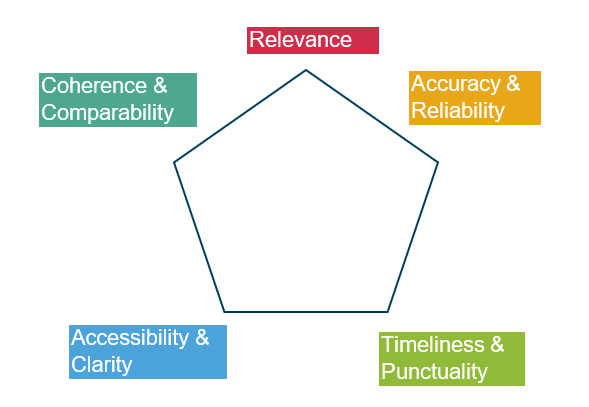
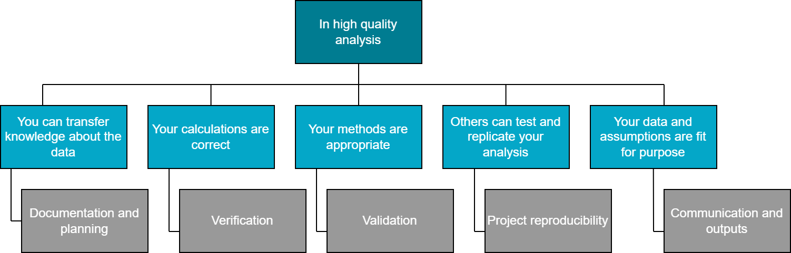

> ## Main messages
> - In high quality analysis, quality assurance operates throughout the data journey and isn’t something that can just be added at the end of production
> - Quality assurance should be planned in advance, with roles, responsibilities, and the extent of assurance activities understood fully by the entire team.
> - Quality assurance should be appropriate and proportionate to the scope, risks, methodology, and data source of a piece of analysis.
> - Understanding user needs is important when measuring the quality of your data. Perfect data quality may not always be achievable and therefore focus should be given to ensuring the data is as fit for purpose as it can be.
> - Teams should make use of the [quality review conversation tool](https://confluence.collab.test-and-trace.nhs.uk/download/attachments/353007964/QA%20review%20conversation%20tool.xlsx?version=1&modificationDate=1716383304798&api=v2) to facilitate discussions around quality and help plan quality assurance, identifying gaps in current procedures.
> - A quality assurance log is a crucial tool to help teams plan, record, and sign off on quality. It provides an audit trail of everything that was checked and what the outcomes were.
> - The [quality assurance process](https://confluence.collab.test-and-trace.nhs.uk/download/attachments/353007964/QA%20log%20template%20v1.2.xlsx?version=1&modificationDate=1716383298406&api=v2) and any outstanding quality concerns should be clearly communicated alongside the final results of the analysis.

## What is quality?

The quality of an analytical output may be thought of in simple terms as its “fitness for purpose”. When data is fit for purpose, it is less likely to be misleading and we can make effective decisions using the data. The [UK Statistics Authority Code of Practice](https://code.statisticsauthority.gov.uk/) uses the [5 Dimensions of Quality of the European Statistical System (ESS) Code of Practice](https://analysisfunction.civilservice.gov.uk/wp-content/uploads/2016/01/ESS-Dimensions-of-Quality.pdf) as its criteria for assessing fitness for purpose of statistical outputs. These 5 dimensions are:

- Relevance
- Accuracy and Reliability
- Timeliness and Punctuality
- Comparability and Coherence
- Accessibility and Clarity

All quality assessments of official statistics should be conducted in line with these dimensions and both our [QA review conversation tool](https://confluence.collab.test-and-trace.nhs.uk/download/attachments/353007964/QA%20review%20conversation%20tool.xlsx?version=1&modificationDate=1716383304798&api=v2) and [QA log template](https://confluence.collab.test-and-trace.nhs.uk/download/attachments/353007964/QA%20log%20template%20v1.2.xlsx?version=1&modificationDate=1716383298406&api=v2) sets out these dimensions for you to consider.

Click on the tabs below to find about more about each of the dimensions.

  <button id="expanded-header-1" aria-controls="expanded-content-1" aria-expanded="false" class="expandable-header">
    Relevance
  </button>
  
  

    

    <ul style="list-style-type:disc;">
  <li> Who are the current and potential users of the output? </li>
  <li> What are the needs of your users? </li>
  <li> How well does the output suit user needs? </li>
  </ul> 
    

  

  <button id="expanded-header-2" aria-controls="expanded-content-2" aria-expanded="false" class="expandable-header">
    Accuracy and Reliability
  </button>
  
  

    

    <ul style="list-style-type:disc;">
  <li> Has every step of the code been tested? </li>
  <li> Do charts and tables agree with the text? </li>
  <li> Are outputs realistic? </li>
  <li> Have manual steps been double checked? </li>
  </ul> 
    

  

  <button id="expanded-header-3" aria-controls="expanded-content-3" aria-expanded="false" class="expandable-header">
    Timeliness and Punctuality
  </button>
  
  

    

    <ul style="list-style-type:disc;">
  <li>Is the release of results sufficiently soon after the release of data? </li>
  <li>Is all data available in a timely manner?</li>
  </ul> 
    

  

  <button id="expanded-header-4" aria-controls="expanded-content-4" aria-expanded="false" class="expandable-header">
    Comparability and Coherence
  </button>
  
  

    

    <ul style="list-style-type:disc;">
  <li>Are the statistics consistent over time and comparable between regions and countries? </li>
  <li>Is it possible to combine and make joint use of related data from different data sources? </li>
  <li>Are your results going to be used in combination with other data on the same topic? </li>
  <li>Do you use <a href = "https://analysisfunction.civilservice.gov.uk/policy-store/?keyword=&area=&doctype=harmonisation-guidance-and-principles&submit=Go" target="_blank">harmonised concepts and definitions</a> wherever they are available? </li>
  </ul> 
    

  

  <button id="expanded-header-5" aria-controls="expanded-content-5" aria-expanded="false" class="expandable-header">
    Accessibility and Clarity
  </button>
  
  

    

    <ul style="list-style-type:disc;">
  <li>Are charts, tables, and formatting compliant with accessibility laws? </li>
  <li>Has quality and methodology information been provided? </li>
  </ul> 
    

  

## Quality trade-off

    
    

The 5 dimensions of statistical output quality are not mutually exclusive. There are relationships between them and there are instances where improvements in one dimension would lead to deterioration in another dimension. Statistics should always be produced to a level of quality that meets users’ needs, and quality assurance should be proportionate to the nature of the quality issues and the importance of the statistics in serving the public good. 
Understanding user needs is really important when measuring the quality of your data. Perfect data quality may not always be achievable and therefore focus should be given to ensuring the data is as fit for purpose as it can be.
    

This may result in trade-offs between different dimensions of data quality, depending on the needs and priorities of your users. You should prioritise the data quality dimensions that align with your user and business needs. For example, if the timeliness of a data set is the most important dimension for the user, this may come at the expense of the data set’s accuracy, and vice versa. It is important to communicate these trade-offs to the users of your data to avoid ambiguity and misuse of the data.

In practice, the nature and extent of quality assurance activities that are carried out for each project should depend on what is considered appropriate and proportionate:
<ul style="list-style-type:disc;">
<li><b>Appropriate</b>: fit for purpose for the analysis depending on its complexity, timeframe of delivery, available resources, and other factors</li>
<li><b>Proportionate</b>: relative to the level of risk entailed by the project</li>
</ul> 

## What do we mean by quality assurance?
Quality assurance (QA) plays an essential part in any analytical project to ensure high quality analysis - it is so much more than just ‘getting the numbers right'. Effective QA ensures that decisions are made with an appropriate understanding of evidence and risks, and helps analysts ensure the integrity of the analytical output. It therefore forms a crucial part of the UKHSA's strategic priority to ["improve action on health security through data and insight"](https://www.gov.uk/government/publications/ukhsa-strategic-plan-2023-to-2026/ukhsa-strategic-plan-2023-to-2026-executive-summary).

&nbsp;

The Data Science QA team in UKHSA have created an [Analytical QA Framework](https://confluence.collab.test-and-trace.nhs.uk/display/QA/UKHSA+Analytics+QA+Framework) to provide a structured approach to this: ensuring that all our analytical work meets the desired level of quality. It aims to support QA activities for all those who work on analytical projects that support a specific decision making process. You can find out more about the framework, as well as more information on the quality assurance of models on their [Confluence page](https://confluence.collab.test-and-trace.nhs.uk/display/QA/UKHSA+Analytics+QA+Framework). The remainder of this guidance will focus solely on the quality assurance of data and statistical outputs.

## The 'QA mindset'

In high quality analysis, we should know how data got from the initial input to a statistical publication. We refer to this as the **data journey**. QA should operate throughout the  entire data journey and is not something that can be added at the end of production. This means that we should be thinking about QA at each stage of our analytical project, from project governance and planning to producing outputs and communicating findings. We need to be thinking about the data sources and their appropriateness, whether our methods are sound and if the interpretation of results is robust, communicating any caveats that need sharing with users. This is known as having a 'QA mindset'. 

It is important for statistical producers to be curious about data and not take it at face-value. If there are values that look inaccurate or unusual they should be investigated and verified. Producers should understand the full data journey and be able to identify steps that are vulnerable and could introduce errors.

There are 4 key areas of a QA mindset to consider when embarking on an analytical project:

**ADD HERE - need to think about how best to do this section **

These key stages along the data journey, alongside the 5 Dimensions of Quality of the European Statistical System (ESS), form the basis of the [QA review conversation tool](https://confluence.collab.test-and-trace.nhs.uk/download/attachments/353007964/QA%20review%20conversation%20tool.xlsx?version=1&modificationDate=1716383304798&api=v2) and [QA log template](https://confluence.collab.test-and-trace.nhs.uk/download/attachments/353007964/QA%20log%20template%20v1.2.xlsx?version=1&modificationDate=1716383298406&api=v2).

## Roles and responsibilities
The AQUA Book defines 3 key roles for QA of analysis: the commissioner, the analyst, and the assurer. These roles are used by many teams to delegate responsibility during QA. In addition, the AQUA Book and [Macpherson Review](https://www.gov.uk/government/publications/review-of-quality-assurance-of-government-models) state that analysis which is business critical should have a single senior responsible officer (SRO).

In practice, the exact nature of roles required may differ based on project scope and needs, but these roles provide a useful framework for considering the different ways QA should be built into the life cycle of a project. The roles are summarised below.

## How can I adopt a QA mindset?
 We have created two tools to help teams discuss, plan, record and sign off on quality:

1. QA review conversation tool
2. QA log template

<button class="download-button" onclick="location.href='https://confluence.collab.test-and-trace.nhs.uk/display/SHT/Ensuring+good+quality+assurance?preview=%2F353007964%2F357508814%2FQA+review+conversation+tool.xlsx'" type="button">
         Download QA review conversation tool</button>
         
<button class="download-button" onclick="location.href='https://confluence.collab.test-and-trace.nhs.uk/display/SHT/Ensuring+good+quality+assurance?preview=%2F353007964%2F357508813%2FQA+log+template+v1.2.xlsx'" type="button">
         Download QA log template</button>        

### What is the QA review conversation tool?
Our [QA review conversation tool](https://confluence.collab.test-and-trace.nhs.uk/download/attachments/353007964/QA%20review%20conversation%20tool.xlsx?version=1&modificationDate=1716383304798&api=v2) was created to provide a useful starting point for thinking about the QA of statistical outputs in line with the five European Statistical System (ESS) Quality Dimensions. It has been designed to facilitate team discussions about quality at either the start of a new project or at regular intervals for cyclical releases to help teams plan QA, identifying gaps in current procedures. We have compiled discussion questions that teams can use to reflect on the quality of their statistics, identify areas for improvement, and consider how to communicate quality to users. The outcomes of these discussions should inform QA plans and QA logs which teams should be using during QA activities. 

### What is the QA log template?
To help teams record and sign off on quality, we have also created a [QA log template](https://confluence.collab.test-and-trace.nhs.uk/download/attachments/353007964/QA%20log%20template%20v1.2.xlsx?version=1&modificationDate=1716383298406&api=v2). This approach is standard practice across government statistics and should ensure that a QA mindset is present when conducting analytical projects. A QA log should be used every time you are producing a publication.

A QA log will:

- provide a consistent, more standardised approach to QA across our statistical publications and analyses

- give the analyst ideas on what to look out for when conducting QA and help discussion within teams

- gives the assurer clearer sight of what exactly has been checked 

- provide an audit trail of everything that was checked and what the outcomes and actions were

An audit trail can be particularly helpful if something goes wrong. You can go back and review your process to see what might have gone wrong and if you need to make any changes to the checks you are doing for next time.

## Utilising these tools
In both templates, there are sheets on the different stages of the QA process as outlined in the 'QA mindset' that relate to the ESS quality dimensions.

Each sheet in the review conversation tool contains space for the assurer to comment on how well they meet requirements and note any outstanding issues or actions to improve quality or how they communicate quality to users. There is also space for the assurer to provide their sign off that they’re satisfied with the QA process at each stage.

In the QA log template, suggested criteria is given in order to attain a high level of quality. Each criterion is given one row, with space for an assurer to describe whether the criterion has been met, the steps they have taken to assess the project against that criterion, and any outstanding work that may need to be completed. This template was created with the intention that teams can adapt and customise it dependent on their needs to create a comprehensive overview. While it is not a complete list of QA concerns, the template provides a starting point for thinking about the assurance process.

The remainder of this guidance will look in more detail at the five main stages of a traditional publication cycle , give guiding questions to consider. Links and resources available to you will also be shown to customise your QA log based on your project and user needs.

| Guiding questions                                                  | Specific considerations                                                                                                                                                                                                                                                                                                       | Why do I need to know the answer to this?                                                                                                                                                                                                                                                                                                                                                                                                               | What help is available?                                                                                                                                                                                                                                                                                                                                                                                                                        |
|--------------------------------------------------------------------|-------------------------------------------------------------------------------------------------------------------------------------------------------------------------------------------------------------------------------------------------------------------------------------------------------------------------------|---------------------------------------------------------------------------------------------------------------------------------------------------------------------------------------------------------------------------------------------------------------------------------------------------------------------------------------------------------------------------------------------------------------------------------------------------------|------------------------------------------------------------------------------------------------------------------------------------------------------------------------------------------------------------------------------------------------------------------------------------------------------------------------------------------------------------------------------------------------------------------------------------------------|
| What is the need for this analysis or statistical release?         | Does the output contribute something new that cannot be found in existing research or literature?  Has there been a clear user need for this analysis shown through user consultation?                                                                                                                                  | Understanding why the analysis/statistical release is needed and what it will be used for is critical for understanding whether what you have done is fit for purpose.  If you are responsible for part of an analytical/statistical process, understanding the end use will help you to make sure that your part does what is needed to meet user needs.                                                                                         | [Guidance: The AQUA Book](https://assets.publishing.service.gov.uk/government/uploads/system/uploads/attachment_data/file/416478/aqua_book_final_web.pdf)   [Guidance: Analysis Functional Standard](https://www.gov.uk/government/publications/government-analysis-functional-standard--2)                                                                                                                                           |
| Who uses your analysis or statistical release?                     | Does the work meet user needs appropriately?  Have you addressed feedback obtained from recent user consultations?  What are the expectations of my users?  Are the length and content of the publication appropriate for its users?  Are terms defined for your less-technical users?                | Understanding who uses your analysis/statistical release will help you to make sure that it meets their needs.  It also helps you to tailor your outputs to make sure all your users are fully supported in using the outputs effectively.                                                                                                                                                                                                        | [Guidance: User engagement top tips](https://analysisfunction.civilservice.gov.uk/policy-store/user-engagement-top-tips/)                                                                                                                                                                                                                                                                                                                      |
| What analytical question you are addressing?                       | Are questions suitably explicit and do they clearly reflect the evidence gaps the analysis is intended to fill?  Will the output align with overarching departmental/programme goals?                                                                                                                                   | Having a clear understanding of the problem your team is trying to solve ensures that the analysis you design is fit for purpose.  If you do not know how your work is contributing to answering an analytical need, you may be unaware of important requirements or limitations for your part of the work.                                                                                                                                       | [Guidance: The AQUA Book ](https://assets.publishing.service.gov.uk/government/uploads/system/uploads/attachment_data/file/416478/aqua_book_final_web.pdf)   [Guidance: Analysis Functional Standard](https://www.gov.uk/government/publications/government-analysis-functional-standard--2)   [UKHSA Data Strategy](https://intranet.ukhsa.gov.uk/sites/data-analytics-and-surveillance/SitePageModern/49668/data-strategy) |
| Is everyone aware of their role and responsibility in the process? | Is a Senior Responsible Officer (SRO) required as the analysis is business critical?  What is the role of the commissioner in your project? Are there any key changes to the publications that need flagging?  Does the assurer understand the analytical methods used in the project? Are there any skills gaps? | For effective quality assurance, you need to be clear on roles and responsibilities throughout the chain of production. It is not enough to say that an individual will carry out some QA.  Assigning the roles set out in the AQUA book provide a useful framework for considering the different ways QA should be built into the life cycle of a project.  For more information, see Roles and responsibilities section of this guidance. | [Guidance: The AQUA Book](https://assets.publishing.service.gov.uk/government/uploads/system/uploads/attachment_data/file/416478/aqua_book_final_web.pdf)                                                                                                                                                                                                                                                                                      |
 

  <button id="expanded-header-6" aria-controls="expanded-content-6" aria-expanded="false" class="expandable-header">
  1. Project governance
  </button>
  
  

    

  <h2> Project governance </h2>
  Project governance is the most preliminary stage of analysis and focuses on deciding the guiding question, scope, and context of the planned analysis. While there will be few outputs at this step to QA, the decisions made will define the level of QA necessary at later stages. It’s important at this stage that everyone knows and understands their responsibilities, and there is a clear reason for the analysis being conducted. For recurring publications, this stage may not be needed for each release, but the topics covered should still remain under regular review to continually ensure that project needs are met. 
  
  The table below gives some considerations when completing this section of the review conversation & QA log.
  
  | Guiding questions                                                  | Specific considerations                                                                                                                                                                                                                                                                                                       | Why do I need to know the answer to this?                                                                                                                                                                                                                                                                                                                                                                                                               | What help is available?                                                                                                                                                                                                                                                                                                                                                                                                                        |
  |--------------------------------------------------------------------|-------------------------------------------------------------------------------------------------------------------------------------------------------------------------------------------------------------------------------------------------------------------------------------------------------------------------------|---------------------------------------------------------------------------------------------------------------------------------------------------------------------------------------------------------------------------------------------------------------------------------------------------------------------------------------------------------------------------------------------------------------------------------------------------------|------------------------------------------------------------------------------------------------------------------------------------------------------------------------------------------------------------------------------------------------------------------------------------------------------------------------------------------------------------------------------------------------------------------------------------------------|
  | What is the need for this analysis or statistical release?         | Does the output contribute something new that cannot be found in existing research or literature?  Has there been a clear user need for this analysis shown through user consultation?                                                                                                                                  | Understanding why the analysis/statistical release is needed and what it will be used for is critical for understanding whether what you have done is fit for purpose.  If you are responsible for part of an analytical/statistical process, understanding the end use will help you to make sure that your part does what is needed to meet user needs.                                                                                         | [Guidance: The AQUA Book](https://assets.publishing.service.gov.uk/government/uploads/system/uploads/attachment_data/file/416478/aqua_book_final_web.pdf)   [Guidance: Analysis Functional Standard](https://www.gov.uk/government/publications/government-analysis-functional-standard--2)                                                                                                                                           |
  | Who uses your analysis or statistical release?                     | Does the work meet user needs appropriately?  Have you addressed feedback obtained from recent user consultations?  What are the expectations of my users?  Are the length and content of the publication appropriate for its users?  Are terms defined for your less-technical users?                | Understanding who uses your analysis/statistical release will help you to make sure that it meets their needs.  It also helps you to tailor your outputs to make sure all your users are fully supported in using the outputs effectively.                                                                                                                                                                                                        | [Guidance: User engagement top tips](https://analysisfunction.civilservice.gov.uk/policy-store/user-engagement-top-tips/)                                                                                                                                                                                                                                                                                                                      |
  | What analytical question you are addressing?                       | Are questions suitably explicit and do they clearly reflect the evidence gaps the analysis is intended to fill?  Will the output align with overarching departmental/programme goals?                                                                                                                                   | Having a clear understanding of the problem your team is trying to solve ensures that the analysis you design is fit for purpose.  If you do not know how your work is contributing to answering an analytical need, you may be unaware of important requirements or limitations for your part of the work.                                                                                                                                       | [Guidance: The AQUA Book ](https://assets.publishing.service.gov.uk/government/uploads/system/uploads/attachment_data/file/416478/aqua_book_final_web.pdf)   [Guidance: Analysis Functional Standard](https://www.gov.uk/government/publications/government-analysis-functional-standard--2)   [UKHSA Data Strategy](https://intranet.ukhsa.gov.uk/sites/data-analytics-and-surveillance/SitePageModern/49668/data-strategy) |
  | Is everyone aware of their role and responsibility in the process? | Is a Senior Responsible Officer (SRO) required as the analysis is business critical?  What is the role of the commissioner in your project? Are there any key changes to the publications that need flagging?  Does the assurer understand the analytical methods used in the project? Are there any skills gaps? | For effective quality assurance, you need to be clear on roles and responsibilities throughout the chain of production. It is not enough to say that an individual will carry out some QA.  Assigning the roles set out in the AQUA book provide a useful framework for considering the different ways QA should be built into the life cycle of a project.  For more information, see Roles and responsibilities section of this guidance. | [Guidance: The AQUA Book](https://assets.publishing.service.gov.uk/government/uploads/system/uploads/attachment_data/file/416478/aqua_book_final_web.pdf)                                                                                                                                                                                                                                                                                      |
    

  

  
  
  <button id="expanded-header-7" aria-controls="expanded-content-7" aria-expanded="false" class="expandable-header">
  2. Project planning
  </button>
  
  

    

  <h2>Project planning</h2>
  
  Effective project planning serves as the roadmap that guides any analytical project from conception to completion. It ensures that the correct documentation is available, risks are mitigated, and deadlines are met. There should be a clear, proportionate QA plan and a consistent project structure with version control.
  
  The table below gives some considerations when completing this section of the review conversation & QA log.
    

  

  
  <button id="expanded-header-8" aria-controls="expanded-content-8" aria-expanded="false" class="expandable-header">
  3. Verification and validation
  </button>
  
  

    

  <h2>Verification and validation</h2>
  
  Whilst verification focuses on confirming that the analysis is being developed correctly according to the specified requirements, validation ensures that the final product meets user needs and answers the defined research question. Both processes are essential for ensuring the quality and reliability of our analytical projects. The key output from the verification process concerns the extent to which the agreed work has been conducted appropriately. The key output from the validation process is a judgment, based on evidence, concerning the extent to which the work is 'fit for purpose'
  
  The tables below gives some considerations when completing this section of the review conversation & QA log.
    

  

  
  <button id="expanded-header-9" aria-controls="expanded-content-9" aria-expanded="false" class="expandable-header">
  4. Project reproducibility
  </button>
  
  

    

  <h2>Project reproducibility</h2>
  
  When we produce analysis or an analytical output, we need to produce it using the most robust method to remove any question around how it was created. The focus is then directed to what the report is showing. [RAP (Reproducible Analytical Pipelines)](https://confluence.collab.test-and-trace.nhs.uk/pages/viewpage.action?pageId=352277347) is a set of principles and working practices that help you create faster, more robust, and more transparent analytical processes. By making our analysis reproducible, we make it easier for others to quality assure, assess, critique and re-use our methods and results, and for colleagues to assure what we have done.
  
  The tables below gives some considerations when completing this section of the review conversation & QA log.
    

  

  
  
  <button id="expanded-header-10" aria-controls="expanded-content-10" aria-expanded="false" class="expandable-header">
  5. Communication and outputs
  </button>
  
  

    

  <h2>Communication and outputs</h2>
  In this context, the output is defined broadly as the analysis that is officially published, or one that is used for further research or analysis. Quality at this stage refers to how well your ‘final’ outputs meet your users’ needs. Strengths and limitations of your analysis should be communicated clearly to users so that they can understand the data and use it appropriately. For each statistical output, information on quality and methods should be communicated to users both within the main statistical release and in a Quality and Methodology Information (QMI) report.
  
  The tables below gives some considerations when completing this section of the review conversation & QA log.
    

  

## FAQs
Our FAQs page is designed to address the most common queries we receive about quality assurance. Please get in touch with us if there's anything missing that you would like to see.

  <button id="expanded-header-11" aria-controls="expanded-content-11" aria-expanded="false" class="expandable-header">
  How often should I be performing QA checks?
  </button>
  
  

    

    

  

  
  <button id="expanded-header-12" aria-controls="expanded-content-12" aria-expanded="false" class="expandable-header">
  How do I document that my QA is appropriate and proportionate?
  </button>
  
  

    

    

  

  
  
  <button id="expanded-header-13" aria-controls="expanded-content-13" aria-expanded="false" class="expandable-header">
  What guidance has the government released regarding QA?
  </button>
  
  

    

    

  

